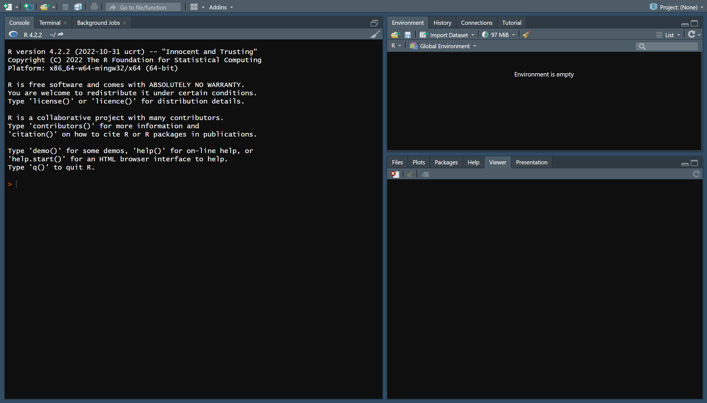

<h1 align="center";>

LearnR

</h1>

Intro to the core R packages and features

By Phillip Post

------------------------------------------------------------------------

## Table of Contents

-   [Setup & Downloads](#setup)
    -   [Downloading R](#downloading-r)
    -   [Downloading Rstudio](#downloading-rstudio)
    -   [Downloading Quarto](#downloading-quarto)
    -   [Clone This Repo](#downloading-quarto)
-   [Welcome to R!](#clone-this-repo)
    -   [Getting Oriented](#getting-oriented)
    -   [Open the R project File](#open-the-r-project-file)
-   [Lesson 1: Installing and Loading Packages](#lesson-1-installing-and-loading-packages)
-   [Lesson 2: Into the Tidyverse](#lesson-2-into-the-tidyverse)

------------------------------------------------------------------------

## Setup 

This guide relies heavily on three main resources: **R** provides the language that translates all of our operations into binary that the machine can understand. **Rstudio** is an interactive developer environment (IDE) that I highly recommend for coding in R. It has many comfort features like autocompletion, easy visualization of variables, and simple package management **Quarto** is a markdown based way to code in R, thankfully the most complicated thing about it is the name, and it allows you to write beautiful code while writing accompanying LaTeX and Markdown to document your methadology

Once you have all three of these downloaded, you are off to the races! Note that for this guide all of the setup instructions are for **Windows** but are mostly the same for Linux with plenty of helpful resources online.

### Downloading R 

1.  Go to <https://cran.r-project.org/bin/windows/base/>

2.  Download the latest version of R

3.  Allow the setup wizard to run and accept all of the default settings

### Downloading Rstudio 

1.  Go to <https://posit.co/download/rstudio-desktop/>

2.  Click the download link that corresponds to your operating system

3.  Allow the setup wizard to run and accept all of the default settings

### Downloading Quarto 

1.  Go to <https://quarto.org/docs/download/>

2.  Click the download link that corresponds to your operating system

3.  Allow the setup wizard to run and accept all of the default settings

### Clone this repo 

If you have not done so already, clone this repo into whichever location you would like to keep it.

<https://docs.github.com/en/repositories/creating-and-managing-repositories/cloning-a-repository>

------------------------------------------------------------------------

## Welcome to R!

Remember to take your time as you go through these guides. Everything will not make sense at first and that is to be expected. This resource is meant as a reference guide that you can always come back to, and memorization is not the goal, understanding the overarching concepts is.

### Getting oriented 

Let's start by opening the Rstudio program that is downloaded on your system. You should start on a homescreen that looks like this:

The Rstudio is split between three main areas.

-   The large left panel is the R console (where the code is run) as well as where you will edit your R files

-   The top right panel is almost as important as where you code. This gives you a live feed of your environment (i.e. what variables are loaded and your code can access). At any time, you can click on a variable that is created here to double check that it appears as intended.

-   Finally, the bottom right panel has everything else you could want with the most notable features being a help tab to see documentation on any function and a packages manager to see what packages you have installed or loaded.

### Open the R Project File 

In R, whenever you start a new coding project, create a new .Rproj file! These files tell R where your working directory for a certain coding project is located, meaning that with a .Rproj file you can effortlessly share your code or move it around and R will still know where to find things! These project files also save important details about your coding environment, enabling others to reproduce your work.\
\
Let's start by looking to the top right of the Rstudio IDE and clicking the "Project" drop down menu. In this case, we will click "Open Project" and select the LearnR project file already created for this repository. And that's it! You are now coding in an R project and can rest easy in knowing that your code and environment will be saved in one consistent place.

------------------------------------------------------------------------

## Lesson 1: Installing and Loading Packages

Each lesson will have a corresponding Quarto file in the **Lessons** folder. This readme will give a brief overview of each so you can see the main concepts that are covered, but to actually complete the lesson open the proper .qmd file.

The best part of R is actually its packages and wonderful community. Very little of our code will actually be in base R as packages can enable us to do the same tasks efficiently, concisely, and overall more consistently then if we tried to write everything from scratch.

This lesson will cover:

-   Installing packages in R

-   Loading packages in R

-   Making your life easier with **pacman**

-   Core packages to know

------------------------------------------------------------------------

## Lesson 2: Into the Tidyverse

The Tidyverse is a huge package that has many of the most useful packages in R contained within it. It has everything you will need to load, clean, analyze, and visualize any data you have!

This lesson will cover:

-   loading a dataset

-   what's a tibble?

-   dplyr and pipes

-   dates with lubridate

-   visualizations with ggplot
